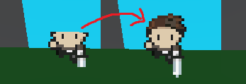

A Godot plugin with a custom Sprite3D type and a shader that avoids clipping when using billboards 

Contains
- A NoClipBillboardSprite3D class that can be used as a simple way to add Sprites to a scene without clipping

------

Using sprites from "Zelda-like tilesets and sprites" by ArMM1998
https://opengameart.org/content/zelda-like-tilesets-and-sprites
